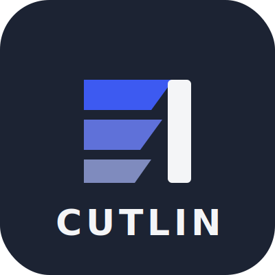

<p align="center">
  
</p>

<h1 align="center">Cutlin</h1>

<p align="center">简体中文 · <a href="README_en.md">English</a></p>

---

把你正在用的 AI 编程助手，变成一支随叫随到的视频制作班底——这就是 Cutlin 做的事。你用一句话描述想要的片子，智能体接手其余全部：查资料、定方案、写稿、配音、做画面、剪辑、渲染，每个关键节点回来找你拍板。

有一件事必须先讲清：市面上大量"AI 视频"其实是给几张静图加运镜。Cutlin 会这一招，但更重要的是它能走**真素材路线**——从开放档案库和免版税素材站里检索真实拍摄的动态影像，按语义排序、有取舍地剪进时间线。产出的是剪辑作品，不是动图幻灯片。

---

## 三分钟上手

装四样东西：**Python 3.10+**（[python.org](https://www.python.org/downloads/)）、**FFmpeg**（macOS `brew install ffmpeg`，Ubuntu `sudo apt install ffmpeg`）、**Node.js 18+**（[nodejs.org](https://nodejs.org/)），以及任意一款 **AI 编程助手**（Claude Code / Cursor / Copilot / Windsurf / Codex 都行）。

```bash
# 取源码，进目录，一键装齐依赖
git clone https://github.com/c18229039407-arch/cutlin.git
cd cutlin
make setup   # = Python 依赖 + Remotion + piper-tts + 生成 .env
```

> **机器上没有 `make`？** 手动跑一遍它做的事即可（macOS/Linux）：
> ```bash
> python3 -m venv .venv && source .venv/bin/activate   # 建好并激活虚拟环境
> python -m pip install -r requirements.txt            # Python 依赖
> ( cd remotion-composer && npm install )              # 渲染引擎依赖
> python -m pip install piper-tts                      # 免费本地 TTS
> cp .env.example .env                                 # 密钥配置模板
> ```
> Windows PowerShell 对应为：
> ```powershell
> py -3 -m venv .venv; .\.venv\Scripts\Activate.ps1   # 建好并激活虚拟环境
> python -m pip install -r requirements.txt            # Python 依赖
> cd remotion-composer; npm install; cd ..             # 渲染引擎依赖
> python -m pip install piper-tts                      # 免费本地 TTS
> Copy-Item .env.example .env                          # 密钥配置模板
> ```
> 若 `npm install` 抛 `ERR_INVALID_ARG_TYPE`，换 `npx --yes npm install` 再试。

装好后，用 AI 助手打开这个目录，像跟制片人说话一样下需求：

```
"我需要一分钟的动画，把神经网络怎么学习讲明白"
```

接下来发生什么？智能体自己联网做选题调研、生成画面素材、按语音指导写稿配音、匹配免版税配乐、烧词级字幕、渲染出片。而且片子送到你面前之前，会先过一遍机器自审：ffprobe 体检、抽帧目检、音频电平分析、交付承诺核对。等不及配置的话，`make demo` 立刻渲一条零密钥样片。

---

## 一条真实生产记录

这不是宣传语，是本仓库维护者用零 API Key 路径实测的一次生产，全程免费：

- **需求**：60 秒中文动画解说《神经网络是如何学习的》
- **旁白**：piper 本地 TTS 中文音色，分 7 段合成、按实测时长精确对轴
- **画面**：7 幕 Remotion 动态图形——开场题卡、权重信息卡、预测对比卡、损失下降折线（核心）、迭代进度条、成果 KPI、收尾卡
- **配乐**：ffmpeg 本地合成的环境 pad，规格化到 -16 LUFS 后以 0.13 音量衬底
- **QA 抓到一个真 bug**：首渲后逐幕抽帧发现折线图为空（数据字段格式不符组件契约），修正重渲后像素级验证通过——这正是"渲染前自审"存在的意义
- **成本**：$0.00；1080p / 30fps / 61 秒成片

---

## 生产看板：Cutlin Studio

聊天窗口只告诉你智能体说了什么；**Studio 让你看见生产实际在做什么**。它是一个本地网页看板：阶段亮灯、剧本落页、素材生成闪烁、每笔决策与花费实时上墙。生产启动时智能体会自动帮你打开；手动方式如下：

```bash
python -m backlot open                  # 项目库 — 磁盘上的所有项目
python -m backlot open <project-id>     # 某次生产的实时看板
python scripts/backlot_simulate_run.py  # 还没跑过项目？看一次模拟生产
```

> **不想敲命令？** 仓库根目录提供双击启动脚本：Windows 双击 `打开观测端.bat`，macOS 双击 `打开观测端.command`（首次运行若被系统拦截，右键 → 打开）。

看板是只读的：它监视 `projects/` 目录、经 SSE 推送到浏览器，不干预生产。批准动作在 AI 助手对话里完成。跑完的项目可点「▶ 回放运行」按时间戳完整回放。细节见 [`backlot/README.md`](backlot/README.md)。

---

### 剪辑室（Cutting Room）

成片之后的"最后一英里"微调不必回到对话：打开 `remotion-composer/public/cutting-room.html`（或在 Studio 项目库页头点「✂ 剪辑室」），得到一块三轨时间线面板——拖块边修剪镜头（自动波纹联动保持首尾相接）、挪动角标、改文案与转场、调音量，空格即可近似预览。它编辑的是 props 声明而非像素：改完导出 `props-edited.json` 交回流水线重渲，声明文件始终是唯一真相源，渲染前后的闸门一个不少。


## 拿一条你喜欢的片子当需求书

不必对着空白提示词发愁。给 Cutlin 一条 **YouTube 长片、Short、Reel、TikTok 链接或本地视频文件**，它会逆向拆解，还原成能直接开工的制作蓝图：

1. **丢参考片进来**
2. **智能体还原它的叙事骨架、剪辑节奏、分镜方式、关键画面与视觉气质**
3. **正式动工前，先给你几版走向不同的概念方案，附工具选型、花费估算和预览小样**

```text
"我把一条很打动我的 YouTube Short 发给你。照着它的感觉，帮我做一条讲量子计算的。"
```

回到你手里的不是玄学提示词，而是一份说得清的方案书：参考片里**哪些被继承**（节奏骨架、开场钩子、叙事结构、基调），**哪些被替换**（主题、视觉处理、切入角度、旁白方式），目标时长下**大概花多少钱**，以及用你手头工具**实际会渲成什么样**。

### 更多提示词灵感

以下每条都会触发一次完整流水线生产。零密钥可跑的：

> "Give me a 45-second animated piece on why cats always land on their feet"（做一条 45 秒动画：猫为什么总能四脚着地）

> "A 60-second narrated video with captions: how container shipping changed the world"（60 秒带旁白和字幕：集装箱如何改变世界）

> "Build a chart-heavy explainer on global renewable energy adoption"（做一条以图表为主的全球可再生能源普及解说）

走真素材纪录片路线的（同样免费）：

> "A 90-second real-footage montage: the last hour before a harbor wakes up. No voiceover, quiet and wistful."（90 秒真实素材蒙太奇：港口苏醒前的最后一小时。不要旁白，安静而怅然。）

> "One minute of archival collage on the Space Race's public euphoria, essay-film flavor, sourced from open archives."（一分钟档案拼贴：太空竞赛年代的大众狂热，视频随笔味道，取材开放档案库。）

> "Real stock footage only: a drifting montage about night trains and the people asleep on them. Score it, skip the narration."（只用真实库存素材：夜行列车与车上睡着的人，一条漂浮感的蒙太奇。配乐要，旁白不要。）

想锁定这条路线，下需求时把关键词说死：点名**纪录片蒙太奇 (documentary montage)**、**音画诗 (tone poem)** 或**素材拼贴 (stock-footage collage)** 之一，并明确加一句**只用真实素材 (use real footage only)**。

配置了生成类供应商后（单条约 $0.15–$3）：

> "30 seconds of Ghibli-flavored animation: a lighthouse keeper who tends a garden of glowing jellyfish at dusk"（30 秒吉卜力味动画：黄昏时分打理发光水母花园的灯塔看守人）

> "Use AI-generated visuals to explain how neural networks learn, aimed at total beginners"（用 AI 生成画面，给纯小白讲清楚神经网络怎么学习）

> "A cinematic 30-second teaser: the day every mirror on Earth started showing a five-second delay"（30 秒电影感预告：某一天，地球上所有镜子都开始延迟五秒）

翻翻 **[提示词画廊](PROMPT_GALLERY.md)**——每条都实际跑通过，标注了预期花费和产出效果。

---

## 能力地图

### 十三条流水线

| 什么时候用它 | 流水线 | 交付什么 |
|----------|----------|-----------------|
| 科普、教程、把一个主题讲透 | **动画解说 (Animated Explainer)** | 调研、旁白、画面、配乐一站配齐的解说成片 |
| 社媒内容、产品展示、抽象概念可视化 | **动画 (Animation)** | 动态图形、字体动效与序列动画 |
| 内部培训、企业口径发布 | **化身代言 (Avatar Spokesperson)** | 由数字人担纲主讲的视频 |
| 品牌形象、造势与推广 | **电影级 (Cinematic)** | 预告、先导与情绪流剪辑 |
| 长视频拆条、社媒分发 | **片段工厂 (Clip Factory)** | 一条长片进，一批排好优先级的短片出 |
| 视频随笔、情绪短片、无付费 API 的真素材成片 | **纪录片蒙太奇 (Documentary Montage)** | 基于 CLIP 检索的开放素材语料库剪出的主题蒙太奇 |
| 在既有素材上叠加视觉增强 | **混合 (Hybrid)** | 你的实拍 + AI 补充画面 |
| 出海与多语种发行 | **本地化与配音 (Localization & Dub)** | 现成视频的翻译、字幕与重新配音 |
| 节目引流、音频内容可视化 | **播客重制 (Podcast Repurpose)** | 把播客的高光段落做成视频 |
| 功能演示、上手教程、配套文档 | **屏幕演示 (Screen Demo)** | 打磨过的软件操作录屏 |
| 演讲实录、vlog、对谈 | **口播 (Talking Head)** | 以真人出镜讲述为主体的成片 |
| 卡通角色驱动的短片 | **角色动画 (Character Animation)** | SVG 绑定角色的本地表演动画 |
| 分钟级多镜头商业片 | **分镜广告 (Storyboard Ad)** | 角色定妆 → 逐镜生成 → 统一调色组装的广告成片 |

共享同一副骨架：`创意 → 调研 → 脚本 → 场景规划 → 素材 → 剪辑 → 合成`。每个阶段由一份 Markdown **导演技能**规定目标、手法与验收线；智能体照章调工具、自查、落检查点，创意节点必停等你点头。调研是硬工序——动笔前对 YouTube、Reddit、新闻与学术源做 15-25 轮检索，内容锚在当下的真实信息上。

### 供应商阵容（每一家都可选，不配走免费路径）

**视频生成 · 14 家**——云端：Kling（画质在线出片快）、Runway Gen-4（电影质感，Gen-3 Alpha Turbo 至 Gen-4 Aleph）、Google Veo 3（长镜头强，走 fal.ai 或 HeyGen）、Grok Imagine Video（参考图出片）、Higgsfield（多模型聚合，Soul ID 锁角色）、MiniMax（性价比）、HeyGen（一 Key 通多家）；本地 GPU 全免费：WAN 2.1（1.3B/14B）、Hunyuan、CogVideo（2B/5B）、LTX-Video（也可自托管 Modal）；素材库兜底：Pexels、Pixabay、Wikimedia Commons。

**图像生成 · 10 路**——FLUX（第一梯队画质）、Google Imagen 4、Grok Imagine（改图/迁移/多图融合强）、GPT Image 2、Recraft（设计向）、本地 Stable Diffusion（免费）、ManimCE（数理动画专用），外加 Pexels / Pixabay / Unsplash 图库。

**语音 TTS · 4 条**——ElevenLabs（音质上限）、Google TTS（700+ 音色 50+ 语言，本地化必备）、OpenAI TTS（快而便宜）、Piper（免费离线）。

**配乐与音效**——Suno（整曲连人声带歌词，最长 8 分钟）、ElevenLabs Music 与 SFX。

**后期全家桶（永远免费）**——FFmpeg 装配压制、Video Stitch 串接转场、Video Trimmer 帧级截取、Audio Mixer 多轨闪避、Audio Enhance 去噪归一、Color Grade 套 LUT、Subtitle Gen 产 SRT/VTT；增强侧有 Real-ESRGAN 超分、rembg 抠背景、CodeFormer/GFPGAN 修脸；分析侧有 WhisperX 词级转写、场景切点检测、关键帧抽取、CLIP/BLIP-2 画面理解；数字人侧有 SadTalker/MuseTalk 驱动与 Wav2Lip 对口型。

> 每家怎么注册、收费几何、免费额度有多少——[`docs/PROVIDERS.md`](docs/PROVIDERS.md) 一篇讲全。

### 三套合成引擎

| 引擎 | 运行形态 | 能力清单 |
|--------|------|-------------|
| **Remotion** | 本地 (Node.js) | 用 React 写视频：图片场景配弹簧动效、数据揭示动画、章节题卡、展示卡片、TikTok 风格逐词字幕、四类转场、Google Fonts 排版、可淡化音频轨、TalkingHead 数字人。**没配视频生成商时自动降级：智能体只出静图，Remotion 负责让它们动起来。** |
| **HyperFrames** | 本地 (Node.js ≥ 22) | 用 HTML/CSS/GSAP 写视频：字体动效、产品短片、发布倒计时、注册制区块（数据图表、噪点层、着色器转场）、网页转视频、SVG 绑定角色表演。一句 `npx hyperframes` 即可调用。 |
| **FFmpeg** | 本地 | 一切的地基：装配、压制、烧字幕、合音轨、调颜色 |

选 Remotion 还是 HyperFrames，由提案阶段裁定并写入 `render_runtime`、经 `edit_decisions` 固化；开工后擅自换运行时属治理红线，裁量规则见 `skills/core/hyperframes.md`。

---

## 一个 Key 都不配，能走多远

`make setup` 装完即拥有的免费能力：

| 想做什么 | 靠什么免费做到 | 做到什么程度 |
|-----------|-----------|-------------|
| **旁白配音** | Piper TTS | 离线跑在本机，旁白听感自然 |
| **开源影像素材** | Archive.org + NASA + Wikimedia Commons | 公版档案片段、科教影像与纪录片级素材 |
| **额外素材库** | Pexels + Unsplash + Pixabay | 免费图库与视频库，开发者 Key 注册即得 |
| **合成 (React)** | Remotion | 上表全部 Remotion 能力 |
| **合成 (HTML/GSAP)** | HyperFrames | 上表全部 HyperFrames 能力 |
| **后期制作** | FFmpeg | 转码压制、字幕硬烧、多轨混音、色彩处理 |
| **字幕生成** | 内置 | 词级时间轴字幕，自动产出 |

三条几乎不花钱的成片路径：

- **静图动起来**：旁白交给 Piper，画面交给图像工具，Remotion 负责让静态素材带上动感与节奏。
- **卡通角色本地演出**：SVG 骨骼绑定配姿势库，GSAP 排时间线，HyperFrames 渲出角色表演，成片自动落在 `projects/<项目名>/renders/final.mp4`。
- **全真素材剪片**：纪录片蒙太奇流水线先建一座可 CLIP 语义检索的素材语料库，再把真实影像剪成完整作品。

## 想解锁更多？往 .env 里添钥匙

```bash
# .env 里没有必填项：拿到哪把钥匙就填哪把，空着的行删掉也无妨

# ── 一把顶多把的聚合网关 ──────────────────────────
FAL_KEY=<填你的密钥>            # 打通 FLUX/Recraft 出图与 Veo/Kling/MiniMax 出片

# ── 免费素材站（注册即领）─────────────────────────
PEXELS_API_KEY=<填你的密钥>     # 视频 + 图片素材库
PIXABAY_API_KEY=<填你的密钥>    # 视频 + 图片素材库
UNSPLASH_ACCESS_KEY=<填你的密钥> # 图片素材库

# ── 配乐 ─────────────────────────────────────
SUNO_API_KEY=<填你的密钥>       # AI 作整曲：带人声、带伴奏、流派随选

# ── 语音与图像各家直连 ─────────────────────────
ELEVENLABS_API_KEY=<填你的密钥> # 第一梯队 TTS，附带音乐与音效能力
OPENAI_API_KEY=<填你的密钥>     # 解锁 OpenAI 的 TTS 与 GPT Image 2
XAI_API_KEY=<填你的密钥>        # Grok 的图像编辑/生成与视频生成
GOOGLE_API_KEY=<填你的密钥>     # Imagen 出图 + 700 余种音色的 Google TTS

# ── 再多几家视频供应商 ─────────────────────────
HEYGEN_API_KEY=<填你的密钥>     # 一个入口转接 VEO/Sora/Runway/Kling
RUNWAY_API_KEY=<填你的密钥>     # 直连 Runway Gen-4
```

<details>
<summary><strong>机器带 GPU？本地视频生成一分钱不花</strong></summary>

```bash
make install-gpu

# 装完在 .env 里打开本地生成开关：
VIDEO_GEN_LOCAL_ENABLED=true
VIDEO_GEN_LOCAL_MODEL=wan2.1-1.3b  # 可换：wan2.1-14b / hunyuan-1.5 / ltx2-local / cogvideo-5b
```

</details>

---

## 为什么值得选它

- **十三条成建制的流水线**：从解说、口播、录屏、预告、动画、播客拆条、多语配音、真素材蒙太奇，到分镜驱动的分钟级广告片，一条不缺
- **九十六件注册工具**：视频与图像生成、配音、作曲、混音、字幕、画质增强、内容理解，registry 实测计数
- **七百余份智能体技能**：制作规范、阶段导演、创意方法论、质检清单加深度技术手册，把"会用工具"升级成"用得地道"
- **拿参考片当需求书**：丢一条你欣赏的视频进来，系统把它翻译成一份既扎实又不雷同的制作方案
- **不买视频模型照样出真片**：靠免费与开源渠道的真实影像和档案素材剪成片
- **谁家都锁不住你**：供应商随插随换，7 个维度打分自动择优
- **出厂标准向生产级看齐**：交付承诺拦"会动的 PPT"，合成前校验省 GPU，渲染后强制自审，每个决策进可审计的日志
- **钱袋子有闸门**：事前估价、支出上限、单笔审批阈值三重保险

自己拍的口播交给它精剪；一条全动画解说从零起稿；两小时的播客拆出一打社交短片；同一条内容配成十国语言。**凡是一支制作团队排得出的活儿，Cutlin 都排得动。**

---

## 系统如何运转

架构信条是**智能体优先 (agent-first)**：系统里不存在躲在后台调度一切的编排程序——坐在编排席上的，就是你的 AI 编程助手自己。

```
你说："帮我做一条讲黑洞如何形成的解说片"
 │
 ▼
读流水线清单 (YAML)：这次生产有哪些阶段、用哪些工具、验收线在哪
 │
 ▼
读阶段导演技能 (Markdown)：每一步具体该怎么干
 │
 ▼
调 Python 工具干活：选型器先按 7 个维度给候选工具排座次
 │
 ▼
按审阅者技能自查：Schema 校验、是否忠于剧本、质量达标与否
 │
 ▼
落盘检查点 (JSON)：断点可续，决策日志与成本快照随行
 │
 ▼
到创意节点就停：方案摆到你面前，等你点头再走
 │
 ▼
合成前闸门：核交付承诺、测幻灯片风险、查渲染器合规
 │
 ▼
开渲染（Remotion 或 FFmpeg）：按视觉语法匹配合成引擎
 │
 ▼
渲染后复检：ffprobe、抽帧、音频分析、承诺兑现核对
 │
 ▼
成片出厂——前提是通过了上面每一道检查
```

**Python 只管干活和存档，不管拿主意。** 创意判断、编排逻辑、审查标准、质量门槛，全部写在人类可读的 YAML 清单与 Markdown 技能里，随你审阅改写。每个决定连同备选项、置信度与推理一起留档。

### 仓库地形图

```
Cutlin/
├── tools/              # 48 件 Python 工具——智能体伸得出去的"手"
│   ├── video/          # 视频生成 ×13，外加合成、拼接与裁切
│   ├── audio/          # TTS ×4，Suno/ElevenLabs 配乐，混音与音频增强
│   ├── graphics/       # 图像/图形生成 ×9，含图表、代码卡片、数学动画
│   ├── enhancement/    # 超分放大、抠背景、面部修复、调色
│   ├── analysis/       # 语音转写、场景切分、抽帧
│   ├── avatar/         # 数字人与唇形同步
│   └── subtitle/       # 产出 SRT/VTT 字幕
│
├── pipeline_defs/      # YAML 流水线清单——智能体照着演的"分场剧本"
├── skills/             # Markdown 技能库——智能体的"业务知识"
│   ├── pipelines/      # 每条流水线各阶段的导演技能
│   ├── creative/       # 创意手法类技能
│   ├── core/           # 核心工具用法
│   └── meta/           # 审阅规范与检查点协议
│
├── schemas/            # 15 份 JSON Schema，产物契约在此验明正身
├── styles/             # 视觉风格剧本（YAML）
├── remotion-composer/  # React/Remotion 合成引擎
├── lib/                # 地基设施：配置、检查点、流水线装载
└── tests/              # 契约测试、QA 集成与评估套件
```

知识按三层组织：

```
第 1 层  tools/ + pipeline_defs/    盘点家底：有哪些能力可调，怎么编排
第 2 层  skills/                    立好规矩：Cutlin 的用法约定与验收标准
第 3 层  .agents/skills/            补足专业：具体技术领域的深度知识包
```

每个工具都会自报家门：声明自己关联哪些第 3 层知识包。智能体第 1 层点清家底，第 2 层学会规矩，真要钻进某项技术的细节，再翻第 3 层。

---

## 生产治理

用对待软件工程的严格程度对待视频生产：每个阶段有质检关卡，每个决定有审计痕迹，每笔支出有约束。

**质量检验门。** 合成前校验拦下违反交付承诺的方案（承诺"以运动为主"却 80% 静图）、幻灯片风险危急的方案、渲染器族缺失的方案——烂方案在烧 GPU 之前就被截停。渲染后自审跑 ffprobe、四点抽帧排黑屏、分析音频静音与削波、核对承诺、查字幕，不过关的片子不见人。PPT 风险按 6 个维度打分，堵住"会动的 PPT"式产出。用户交自有素材时逐个探查文件真实参数，不靠文件名脑补内容。

**评分制选型。** 任何一次供应商选型都要打分，落选者的分数同样入档。图像、语音、音乐走 7 维通用打分：任务契合 30%、输出质量 20%、控制能力 15%、可靠性 15%、成本效益 10%、延迟与连续性各 5%。视频另走一套 8 维场景加权打分——提示词跟随、运动稳定、视觉质量、物理准确性、主体一致性、可控性、音频能力、工程维度——权重随内容场景切换：电商广告把主体一致性与工程维度各压到 25%，品牌 TVC 把可控性与视觉质量各提到 20%，纪实类把物理准确性拉到 20%。每家供应商的基线分带置信度与采购状态标记，买不到的供应商即便原始分最高也不会被选中。选型器还会把松散简报自动展开成可评分的意图信号——哪怕手里只有一句"皮克斯风格、角色一致的动画短片"。评分结果附带胜出方的 `agent_skills` 索引，写生成提示词之前可顺藤读完对应知识包。

**决策审计。** 供应商、风格剧本、配乐、音色、渲染器族，以及任何备选与降级——连同置信度和推理一起记录，跨阶段累积持久保存。成片长成什么样，每一步都可回溯。

**预算闸门。** 花之前先报价，调用时先圈钱，结束后再对账；`observe` / `warn` / `cap` 三档管控任选；默认 0.50 美元以上的单笔动作挂起等确认；全局封顶默认 10 美元，数字随你改。

---

## 风格与输出规格

三套**风格剧本**充当一次生产的视觉宪法，统一排版、配色、运动语言、音频配置与质量规则：干净专业（企业宣传、教育课程、SaaS）、扁平动态图形（社媒短内容、TikTok、创业团队）、极简图解（硬核技术拆解、架构讲解）。

**输出档位**开箱即备：横屏 16:9 有 YouTube 1080p / 4K 与 LinkedIn；竖屏 9:16 覆盖 Shorts、Reels、TikTok（1080×1920）；方形 1:1 对应 Instagram 动态（1080×1080）；还有 21:9 电影宽幅（2560×1080）。

---

## 如果你是正在读这份文档的智能体：欢迎上岗

这座仓库本来就是为智能体施工准备的。最快进入状态的顺序：

1. **规则先行**
   开工前把 [`AGENT_GUIDE.md`](AGENT_GUIDE.md) 通读一遍，接着看 [`PROJECT_CONTEXT.md`](PROJECT_CONTEXT.md) 建立全局认知。
2. **工作流不许现编**
   一切生产走既定流水线：编排看 `pipeline_defs/`，各阶段怎么演看 `skills/pipelines/` 的导演技能，可用工具由 registry 扫描给出。
3. **开工前先清点装备**
   跑这两条命令看看当前环境解锁了什么：
   ```bash
   python -c "from tools.tool_registry import registry; import json; registry.discover(); print(json.dumps(registry.support_envelope(), indent=2))"
   python -c "from tools.tool_registry import registry; import json; registry.discover(); print(json.dumps(registry.provider_menu(), indent=2))"
   ```
4. **每条视频需求，第一问都是"该走哪条流水线"**
   顺序铁律：先定流水线，再读它的清单，再读阶段技能，最后才轮到调工具。

各平台入口文件已备好：Claude Code 看 `CLAUDE.md`，Cursor 看 `CURSOR.md` 与 `.cursor/rules/`，GitHub Copilot 看 `COPILOT.md` 与 `.github/copilot-instructions.md`，Codex 看 `CODEX.md`，Windsurf 看 `.windsurfrules`——殊途同归，最终都指向 `AGENT_GUIDE.md`（操作契约）与 `PROJECT_CONTEXT.md`（架构地图）两份母文档。

> 路线图上的一项：对接 **Ollama** 和 **LM Studio**，让整条流水线由本地大模型驱动，彻底摆脱云端依赖。

---

## 扩展与参与

架构天生留了扩展口。加一件新工具：挑好归属的 `tools/` 子目录落一个 Python 文件，继承 `BaseTool` 补齐契约方法，registry 扫描时自动收编，用法不自明的配一份技能文档。加一条新流水线：先在 `pipeline_defs/` 用 YAML declare 出清单，再到 `skills/pipelines/<流水线名>/` 给每个阶段配导演技能，工具能复用就复用。

深挖资料：技术全景在 `docs/ARCHITECTURE.md`，供应商注册/价格/额度在 `docs/PROVIDERS.md`，智能体契约在 `AGENT_GUIDE.md`。

**测试**：

```bash
# 契约测试套件——一个 API Key 都不配也能全绿
make test-contracts

# 全量测试
make test
```

**反馈**：Bug、功能建议和工作流讨论统一走 [GitHub Issues](https://github.com/c18229039407-arch/cutlin/issues)。

---

## 许可证

[GNU AGPLv3](LICENSE)


---

**Cutlin** — 由你的 AI 助手执导、带真实质检关卡的生产级视频系统。
